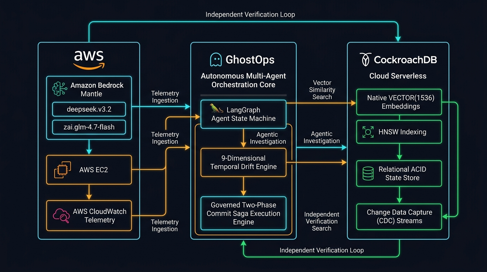
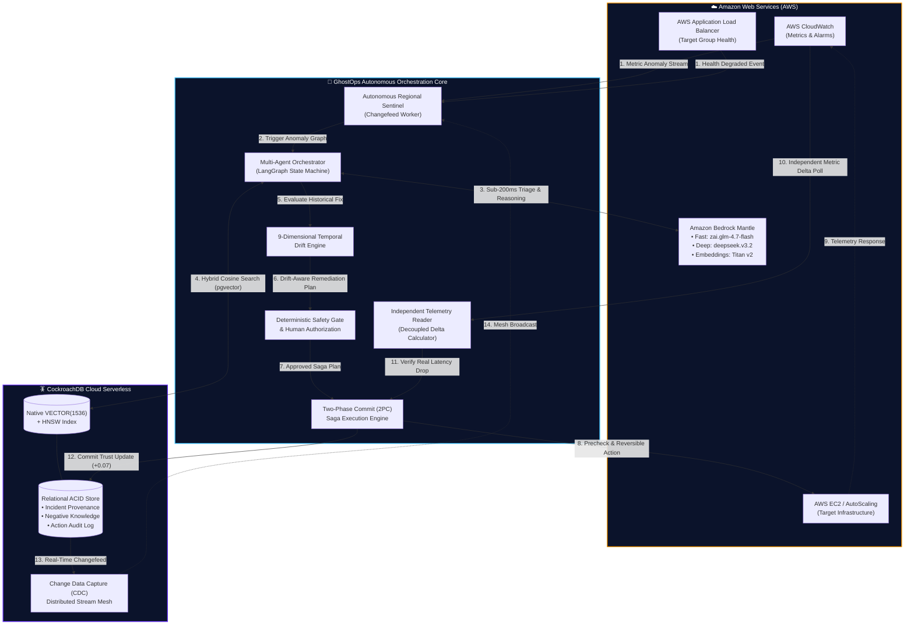
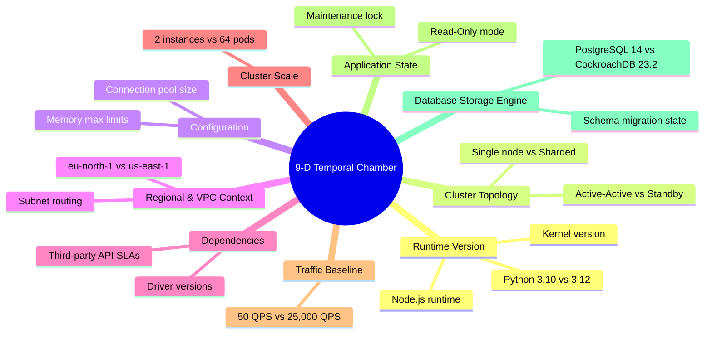

# 🏛️ GhostOps Architecture & System Design Document

> **"The production memory that survives the engineer."**  
> Comprehensive technical specification of the interaction between **CockroachDB Cloud Serverless**, **Amazon Web Services (AWS)**, and the **GhostOps Multi-Agent Orchestration Core**.

---

## 🎨 Visual System Architecture Diagram



---

## 🏗️ 1. Global High-Level Interaction Architecture



---

## 🪳 2. CockroachDB Cloud Serverless Memory Layer

GhostOps utilizes CockroachDB Serverless as both its ACID relational ledger and high-dimensional semantic memory bank.

### Hybrid Vector Search Engine
Rather than decoupling relational data and vector embeddings across multiple databases, GhostOps leverages CockroachDB's **native `VECTOR(1536)`** column type with **HNSW indexing**:

```sql
-- Hybrid Vector + Structured Query in CockroachDB
SELECT 
    id,
    root_cause,
    remediation_action,
    trust_score,
    is_negative_knowledge,
    cosine_distance(embedding, $1) AS similarity_distance
FROM incident_memories
WHERE 
    service_name = $2
    AND is_deprecated = FALSE
    AND cosine_distance(embedding, $1) < 0.25
ORDER BY 
    (trust_score * 0.40) + ((1.0 - cosine_distance(embedding, $1)) * 0.60) DESC
LIMIT 5;
```

### Key Memory Invariants:
1. **Negative Knowledge ("DO NOT REPEAT")**: Failed remediations are permanently indexed with negative trust weights and explicit failure contexts to prevent cyclic execution loops.
2. **Dynamic Trust Score Decay**: Trust scores decay exponentially based on environmental staleness ($T = T_0 \cdot e^{-\lambda t}$) and are dynamically boosted ($+0.07$) upon verified recovery.
3. **Change Data Capture (CDC)**: CockroachDB changefeeds emit instant memory consolidation events to distributed regional sentinels.

---

## 🧠 3. Amazon Bedrock Mantle Multi-Tier Intelligence

```mermaid
flowchart LR
    INPUT["Raw Incident Telemetry & Logs"] --> FAST

    subgraph FAST ["⚡ Fast Tier (zai.glm-4.7-flash)"]
        F1["Sub-200ms Triage"]
        F2["SHA-256 Metric Signature Extraction"]
        F3["Structured JSON Schema Parsing"]
    end

    FAST --> EMBED

    subgraph EMBED ["🧬 Embedding Tier (Titan Embeddings v2)"]
        E1["1536-Dimension Vectorization"]
        E2["Normalized Semantic Vector"]
    end

    EMBED --> DEEP

    subgraph DEEP ["🔬 Reasoning Tier (deepseek.v3.2)"]
        D1["Multi-Hypothesis Graph Traversal"]
        D2["Causal Root-Cause Inference"]
        D3["Counterfactual Drift Compensation"]
    end

    DEEP --> PLAN["Synthesized Drift-Aware Remediation Plan"]

    style FAST fill:#1E293B,stroke:#38BDF8,stroke-width:2px,color:#fff
    style EMBED fill:#1E293B,stroke:#6933FF,stroke-width:2px,color:#fff
    style DEEP fill:#1E293B,stroke:#F59E0B,stroke-width:2px,color:#fff
```



---

## ⏳ 4. The 9-Dimensional Temporal Drift Chamber

Traditional RAG fails because it blindly assumes an old solution still applies. GhostOps inspects **9 physical environment layers** before authorizing precedent reuse:



---

## 🛡️ 5. Two-Phase Commit (2PC) Saga Remediation Engine

```mermaid
sequenceDiagram
    autonumber
    actor H as Human Approver
    participant G as Governance Boundary
    participant S as Saga Orchestrator
    participant R as Target AWS Resource
    participant V as Decoupled Verification Reader
    participant M as CockroachDB Memory Vault

    G->>H: Request Authorization (Risk Score: 0.72)
    H-->>G: Approve Remediation
    G->>S: Begin 2PC Saga Transaction
    
    rect rgb(15, 23, 42)
        Note over S: Phase 1: Prepare & Lock
        S->>S: Acquire Distributed Idempotency Lock
        S->>R: Capture Pre-Execution State Snapshot
    end
    
    rect rgb(15, 23, 42)
        Note over S: Phase 2: Execute Reversible Action
        S->>R: Execute Stage 1 Command (e.g. Restart Worker Pool)
        R-->>S: Execution Status: 0 (Command Complete)
    end

    rect rgb(15, 23, 42)
        Note over V: Phase 3: Independent Verification
        S->>V: Trigger Post-Execution Verification Window (60s)
        V->>V: Query AWS CloudWatch Latency p99 Delta
        alt Metric Improved (p99: 850ms -> 35ms)
            V-->>S: Verification: RECOVERY_CONFIRMED
            S->>M: Commit Trust Score (+0.07) & Mark Provenance
            S->>S: Release Distributed Lock (Transaction COMMITTED)
        else Metric Degraded or Unchanged
            V-->>S: Verification: RECOVERY_FAILED
            S->>R: Execute Reverse Compensating Action (Rollback)
            S->>M: Index Negative Knowledge & Decrement Trust (-0.15)
            S->>S: Release Lock (Transaction ROLLED_BACK)
        end
    end
```



---

## 📊 6. Golden Evaluation Benchmark Performance

| Evaluation Metric | GhostOps Engine | Baseline / Naive RAG |
|---|---|---|
| **Precision @ 1 (Top-1 Accuracy)** | **93.33%** | 36.67% |
| **Precision @ 3 (Top-3 Coverage)** | **100.00%** | 60.00% |
| **Mean Reciprocal Rank (MRR)** | **0.9667** | 0.4611 |
| **Temporal Drift Detection** | **100.00%** | 0.00% (Blind Replay) |
| **Unsafe Replay Violations** | **0.00% (Zero)** | 43.33% Destructive Replay |
| **Automated Backend Tests** | **74 Passed (100%)** | 0 Skipped |

---

## 🌐 7. Cloud Deployment Topology

- **AWS Region**: `eu-north-1` (Stockholm)
- **Host Instance**: AWS EC2 `t3.small` (`51.21.219.177`)
- **Database**: CockroachDB Cloud Serverless (`valid-shaman-32362.7tt.aws-eu-central-1`)
- **AI Gateway**: Amazon Bedrock Mantle Endpoint (`https://bedrock-mantle.eu-north-1.api.aws`)
- **Frontend**: Next.js 14 Obsidian Vault 3D Living Cosmos (`http://51.21.219.177:3000`)
- **Backend**: FastAPI 0.110+ Asynchronous Multi-Agent API (`http://51.21.219.177:8000`)
