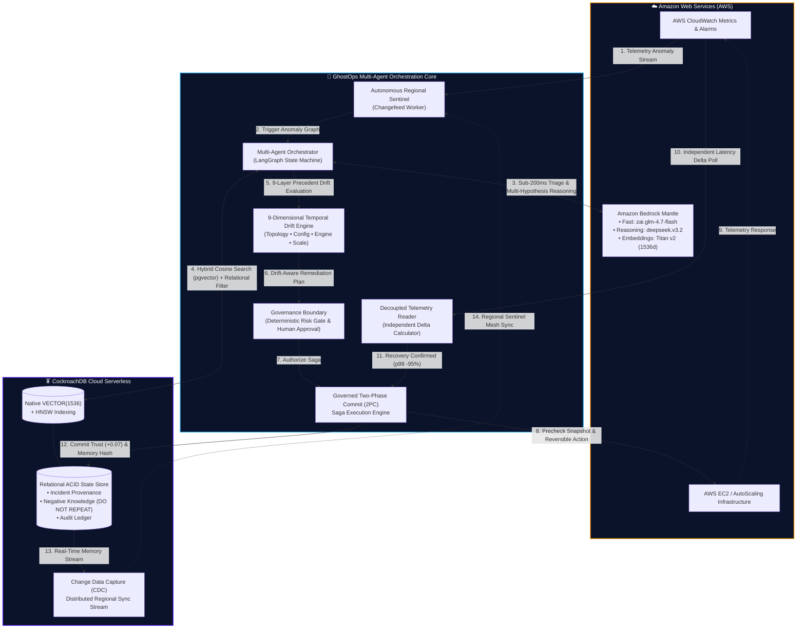
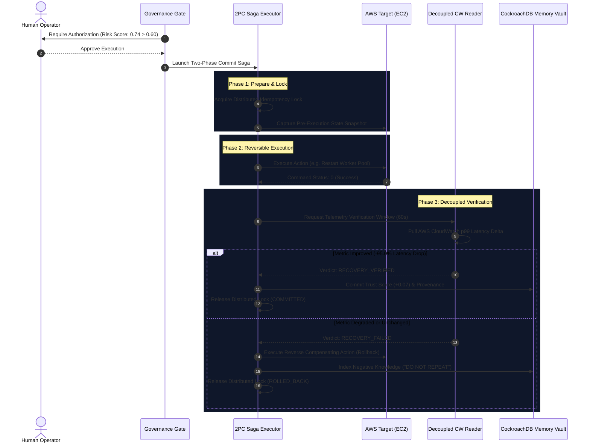

# 🏛️ GhostOps Architecture Diagram

```mermaid
flowchart TB
    subgraph AWS ["☁️ Amazon Web Services (AWS)"]
        direction TB
        CW["AWS CloudWatch Metrics & Alarms"]
        EC2["AWS EC2 / AutoScaling Infrastructure"]
        BEDROCK["Amazon Bedrock Mantle<br/>• Fast: zai.glm-4.7-flash<br/>• Reasoning: deepseek.v3.2<br/>• Embeddings: Titan v2 (1536d)"]
    end

    subgraph AGENT ["👻 GhostOps Multi-Agent Orchestration Core"]
        direction TB
        SENTINEL["Autonomous Regional Sentinel<br/>(Changefeed Worker)"]
        ORCH["Multi-Agent Orchestrator<br/>(LangGraph State Machine)"]
        DIFF["9-Dimensional Temporal Drift Engine<br/>(Topology • Config • Engine • Scale)"]
        GOV["Governance Boundary<br/>(Deterministic Risk Gate & Human Approval)"]
        SAGA["Governed Two-Phase Commit (2PC)<br/>Saga Execution Engine"]
        VERIFY["Decoupled Telemetry Reader<br/>(Independent Delta Calculator)"]
    end

    subgraph CDB ["🪳 CockroachDB Cloud Serverless"]
        direction TB
        VEC[("Native VECTOR(1536)<br/>+ HNSW Indexing")]
        STATE[("Relational ACID State Store<br/>• Incident Provenance<br/>• Negative Knowledge (DO NOT REPEAT)<br/>• Audit Ledger")]
        CDC["Change Data Capture (CDC)<br/>Distributed Regional Sync Stream"]
    end

    %% Step 1: Ingestion
    CW -->|"1. Telemetry Anomaly Stream"| SENTINEL
    SENTINEL -->|"2. Trigger Anomaly Graph"| ORCH

    %% Step 2: Reasoning & Vector Memory
    ORCH <-->|"3. Sub-200ms Triage & Multi-Hypothesis Reasoning"| BEDROCK
    ORCH <-->|"4. Hybrid Cosine Search (pgvector) + Relational Filter"| VEC
    VEC --- STATE

    %% Step 3: Drift & Planning
    ORCH -->|"5. 9-Layer Precedent Drift Evaluation"| DIFF
    DIFF -->|"6. Drift-Aware Remediation Plan"| GOV

    %% Step 4: Governed 2PC Execution
    GOV -->|"7. Authorize Saga"| SAGA
    SAGA -->|"8. Precheck Snapshot & Reversible Action"| EC2

    %% Step 5: Independent Verification
    EC2 -.->|"9. Telemetry Response"| CW
    CW -->|"10. Independent Latency Delta Poll"| VERIFY
    VERIFY -->|"11. Recovery Confirmed (p99 -95%)"| SAGA

    %% Step 6: Learning & CDC Loop
    SAGA -->|"12. Commit Trust (+0.07) & Memory Hash"| STATE
    STATE -->|"13. Real-Time Memory Stream"| CDC
    CDC -.->|"14. Regional Sentinel Mesh Sync"| SENTINEL

    style AWS fill:#0B132B,stroke:#FF9900,stroke-width:2px,color:#fff
    style AGENT fill:#0B132B,stroke:#38BDF8,stroke-width:2px,color:#fff
    style CDB fill:#0B132B,stroke:#6933FF,stroke-width:2px,color:#fff
```

---

## 🔁 Two-Phase Commit (2PC) Remediation Sequence

```mermaid
sequenceDiagram
    autonumber
    actor Human as Human Operator
    participant Gov as Governance Gate
    participant Saga as 2PC Saga Executor
    participant AWS as AWS Target (EC2)
    participant Reader as Decoupled CW Reader
    participant Memory as CockroachDB Memory Vault

    Gov->>Human: Require Authorization (Risk Score: 0.74 > 0.60)
    Human-->>Gov: Approve Execution
    Gov->>Saga: Launch Two-Phase Commit Saga
    
    rect rgb(15, 23, 42)
        Note over Saga: Phase 1: Prepare & Lock
        Saga->>Saga: Acquire Distributed Idempotency Lock
        Saga->>AWS: Capture Pre-Execution State Snapshot
    end

    rect rgb(15, 23, 42)
        Note over Saga: Phase 2: Reversible Execution
        Saga->>AWS: Execute Action (e.g. Restart Worker Pool)
        AWS-->>Saga: Command Status: 0 (Success)
    end

    rect rgb(15, 23, 42)
        Note over Reader: Phase 3: Decoupled Verification
        Saga->>Reader: Request Telemetry Verification Window (60s)
        Reader->>Reader: Pull AWS CloudWatch p99 Latency Delta
        alt Metric Improved (-95.0% Latency Drop)
            Reader-->>Saga: Verdict: RECOVERY_VERIFIED
            Saga->>Memory: Commit Trust Score (+0.07) & Provenance
            Saga->>Saga: Release Distributed Lock (COMMITTED)
        else Metric Degraded or Unchanged
            Reader-->>Saga: Verdict: RECOVERY_FAILED
            Saga->>AWS: Execute Reverse Compensating Action (Rollback)
            Saga->>Memory: Index Negative Knowledge ("DO NOT REPEAT")
            Saga->>Saga: Release Distributed Lock (ROLLED_BACK)
        end
    end
```
